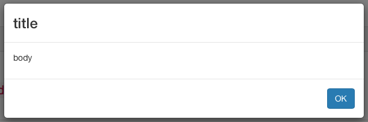
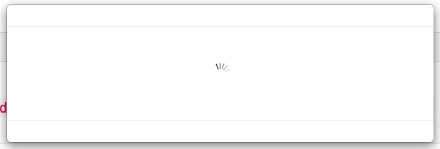
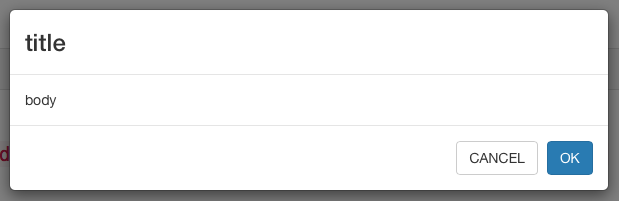
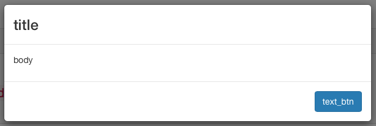

# dialog-modal
Angularjs service to create very simple modal popup. 

* ```Easy to install```
* ```No waste time```
* ```Popup```: ```Alert, Confirm, Waiting, ConfirmWithRedirect```

## Installation

```sh
npm install https://github.com/Arfius/dialog-modal.git
```

## Get Started

Include the dialog-modal dependency on your Angular module:

```js
var app = angular.module("example", ['dialogModalService']);
```
Include the dependencies

```html
<script src="node_modules/angular/angular.js"></script>
<script src="node_modules/angular-sanitize/angular-sanitize.js"></script>
<script src="node_modules/angular-animate/angular-animate.js"></script>
<script src="node_modules/angular-ui-router/release/angular-ui-router.js"></script>
<script src="node_modules/angular-ui-bootstrap/dist/ui-bootstrap.js"></script>
<script src="node_modules/angular-css/angular-css.min.js"></script>
<script src="node_modules/angular-ui-bootstrap/dist/ui-bootstrap-tpls.js"></script>
<script src="node_modules/dialog-modal/dist/dialogmodal.ser.js"></script>
```
Inject variable dialogModal on Controller and set the Element to append the popup


```js

app.controller('mainCtrl', ['$scope','dialogModal',function($scope,dialogModal)
dialogModal.setElement($document.find('aside').eq(0));

```
Then, use  dialogModal as below:

```js
//Alert Popup
dialogModal.showAlert("title","body","OK");
```


```js
//Waiting Popup
dialogModal.showWaiting();
//for dismissing the Waiting Popup invoke hide()
dialogModal.hide();
```



```js
//Confirm Popup
//the callback_btn_ok is invoked by "OK" button
//the parameter for callback_btn_ok is the object {param:'yes'}
dialogModal.showConfirm("title","body","CANCEL","OK",callback_btn_ok,{param:'yes'});
```



```js
//ConfirmWithRedirect Popup
//the routing object is indicated in the last paratmer: {route:'state', param:null}
dialogModal.showAlertWithRedirect("title","body","text_btn",{route:'state', param:null})
```


## Example
Check the example in ```example``` directory. Run the example with

```
cd example
npm install
```
